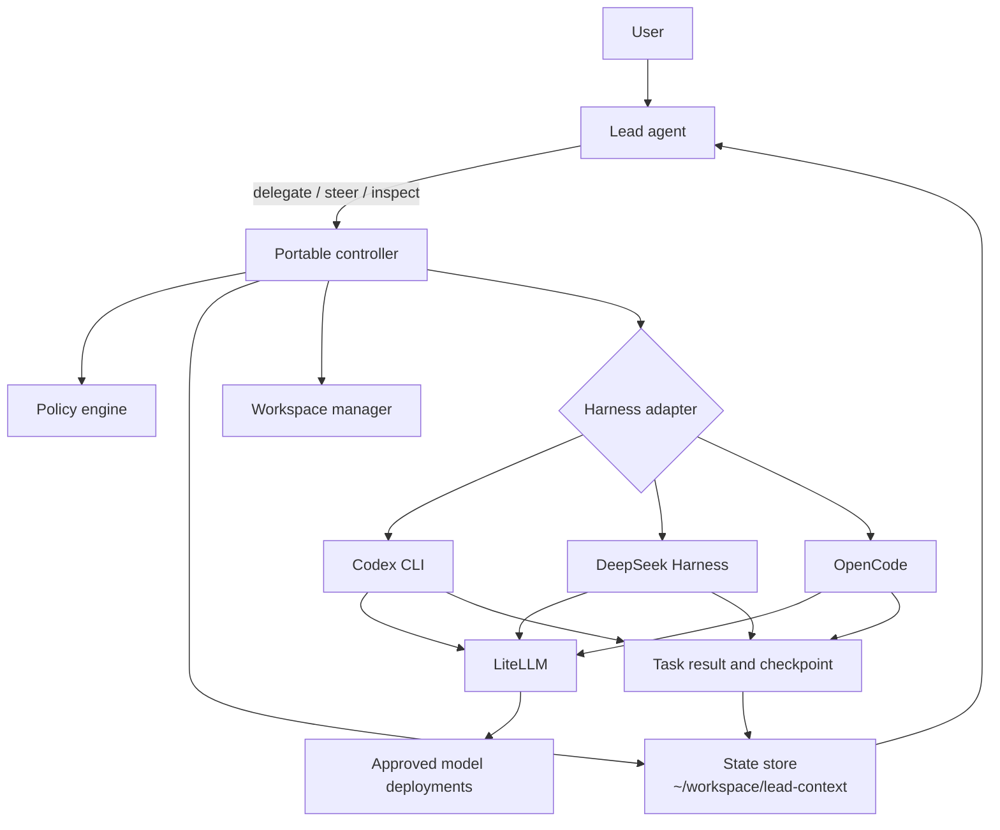
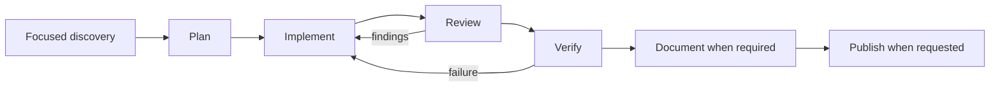

# Architecture

## 1. Design summary

Agent Harness separates orchestration from model execution.

The lead decides what work is needed. A controller validates each delegation against policy, creates a durable task record, prepares an isolated execution environment, and starts the selected harness. A harness adapter converts the portable request into harness-specific commands and session operations. Workers report through files and structured controller events.



The portable state is authoritative for orchestration. Native session state improves continuation within one harness but does not replace the portable record.

## 2. Components

### 2.1 Lead agent

The lead is accountable for the end-to-end result. It may run in OpenCode, Codex, DeepSeek Harness, or another supported harness.

The lead:

- captures the user's request and later corrections verbatim;
- performs or delegates focused discovery, including code exploration;
- chooses the next role, harness, and allowed model;
- supplies sufficient context in every delegation;
- reviews worker output before advancing the workflow;
- sends corrections to the same worker when continuation is useful;
- verifies completion against acceptance criteria;
- updates durable project state so another lead can take over;
- prevents conflicting writers and unjustified scope expansion.

The lead can inspect source directly when its own harness permissions allow it. Code exploration is also a first-class delegated role.

### 2.2 Controller

The controller is the enforcement and lifecycle layer. It must not rely on prompts for rules that can be checked mechanically.

Responsibilities:

- validate role, model, harness, permissions, and route policy before launch;
- allocate task IDs and create task directories;
- materialize context and immutable request metadata;
- prepare a read-only checkout, Git worktree, disposable worktree, or container;
- issue a role-specific LiteLLM credential when configured;
- start, monitor, resume, steer, cancel, and hand off workers;
- record requested and resolved model identity;
- append ordered lifecycle events;
- perform atomic status updates and stale-worker detection;
- enforce one writer per source branch or working tree;
- redact secrets from persisted command and provider metadata.

The controller should expose a CLI first and an MCP server second. Both interfaces call the same internal service.

### 2.3 Policy engine

The policy engine evaluates a delegation request before any model call.

It checks:

- the role exists;
- the requested harness is allowed for the role;
- the requested model alias is allowed for the role;
- the model alias maps to an approved underlying engine;
- adjacent sequential stages use different underlying engines when required;
- filesystem, network, and tool permissions do not exceed role limits;
- the requested workspace strategy is compatible with the role;
- the lead is authorized to delegate from the active project;
- no conflicting writer lease exists.

Role-specific multi-model sets belong here. This avoids dependence on whether a harness supports per-role model allowlists.

### 2.4 State store

The default state root is:

```text
~/workspace/lead-context/
```

It contains project state, task records, leases, and a small index. Plain text and JSON files keep the state readable and recoverable. A later SQLite index may accelerate queries, but files remain the interchange format.

### 2.5 Workspace manager

The workspace manager creates execution environments according to the role:

| Role | Default workspace |
|---|---|
| `code-explorer` | Read-only source checkout |
| `task-planner` | Read-only source checkout |
| `code-implementer` | Dedicated writable Git worktree |
| `code-reviewer` | Read-only implementation worktree and diff |
| `test-verifier` | Disposable writable verification worktree |
| `documentation-writer` | Dedicated writable worktree scoped to documentation |
| `commit-agent` | Approved implementation worktree with Git credentials scoped to publication |

Verifier workspaces are writable because compilers and test runners commonly create caches and build output. The controller validates the source diff after verification and rejects unexpected source changes.

### 2.6 Harness adapters

Each adapter implements a common contract:

```text
start(request, environment) -> session
status(session) -> runtime status
steer(session, message) -> delivery receipt
resume(session, message?) -> runtime status
cancel(session) -> final runtime status
checkpoint(session) -> portable checkpoint
collect(session) -> result and provider evidence
```

An adapter owns harness-specific session IDs and command syntax. The controller treats those values as opaque.

### 2.7 LiteLLM

All supported adapters should route model calls through LiteLLM when the harness permits a custom OpenAI-compatible provider.

LiteLLM provides:

- stable internal model aliases;
- virtual-key model allowlists;
- per-role or per-task budgets;
- token and cost accounting;
- deployment selection and fallback policy;
- requested and resolved route metadata.

The implementation must record the resolved model group and deployment ID. A requested alias alone does not prove which engine served the request.

## 3. Workflow

### 3.1 Standard engineering workflow



Stages are selected by task need. A trivial, fully specified edit may go directly to implementation and review. Behavioral changes require practical verification. Public behavior or configuration changes require documentation. Publication occurs only when requested.

### 3.2 Delegation sequence

1. The lead writes or updates the project request and current state.
2. The lead submits a delegation containing role, harness, model, objective, scope, acceptance criteria, evidence, unknowns, and desired workspace.
3. The controller validates policy and acquires the necessary leases.
4. The controller writes the task request and context before launching a process.
5. The adapter starts the harness with the task directory and output contract.
6. The worker emits progress, input requests, results, and a final checkpoint.
7. The controller records provider evidence and validates the resolved route.
8. The lead reads the result, updates canonical project state, and chooses the next action.

### 3.3 Correction cycle

Review or verification findings should return to the same implementer session when its harness supports continuation. The controller stores each steering message before delivery. If the native session is unavailable, the controller launches a replacement using the latest checkpoint, findings, task artifacts, and current worktree.

The default correction limit is three cycles. Reaching the limit produces an escalation event and a concise report for the lead.

### 3.4 Cross-harness handoff

Native session IDs only work in their originating harness. Cross-harness handoff therefore creates a normalized checkpoint containing:

- objective and acceptance criteria;
- completed work and current understanding;
- evidence and source references;
- decisions and their reasons;
- failed approaches;
- unresolved questions and risks;
- current repository, commit, branch, and worktree state;
- relevant artifacts and pending steering messages;
- recommended next action.

The destination adapter creates a new native session from this checkpoint. The task lineage records both sessions.

## 4. Lead portability

A replacement lead can run in any supported harness. It restores state by reading:

1. the project objective and constraints;
2. the decision log and current state;
3. active tasks and their latest events;
4. completed results that have not been integrated;
5. writer and lead leases.

It then acquires the project lead lease. The lease contains an owner ID, host, process identity, acquisition time, heartbeat, and expiry. Takeover requires an expired lease or an explicit release. This prevents two leads from independently assigning conflicting work.

## 5. Concurrency

Read-only workers may run concurrently when their tasks are independent. Writable workers use separate worktrees. Only one worker may own the writer lease for a given branch or working tree.

The controller may allow parallel implementation work when each worker has a distinct worktree and file ownership boundaries. Integration remains a separate explicit task.

## 6. Trust and verification

Worker summaries are claims. Later stages validate them against files, diffs, command output, or fresh practical evidence.

The controller validates mechanical facts:

- process exit state;
- artifact presence and schema;
- source changes outside scope;
- model route and fallback metadata;
- workspace and lease ownership;
- event sequence integrity.

The reviewer and verifier validate semantic correctness. The lead decides whether the combined evidence meets the user's request.

## 7. Key architecture decisions

1. Independent worker processes are the default execution unit.
2. Native subagents are an optional adapter optimization for tasks that can share the parent's sandbox, credentials, and provider configuration.
3. Portable files are the canonical handoff; native sessions are continuation accelerators.
4. Model authorization is enforced by the controller and LiteLLM.
5. Model diversity rules compare resolved engines rather than aliases.
6. Each writable role receives an isolated worktree.
7. Steering is persisted before delivery.
8. Code exploration is a delegable role.
9. The lead context root is `~/workspace/lead-context`.
